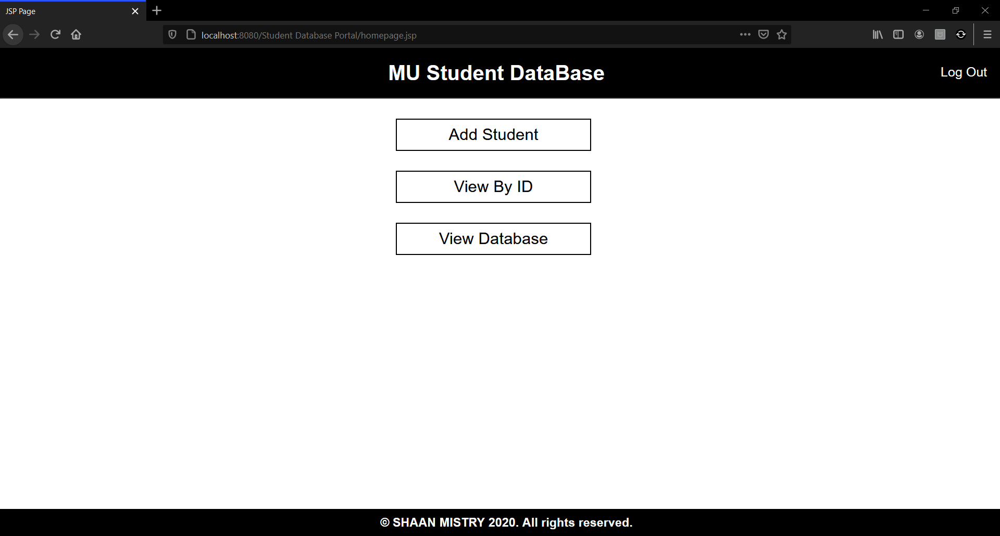

# Student-Database-Portal
This is an CRUD project using Java Servlets &amp; JSP. The database part is done in MySQL.

Below are the snippets of the project.

# Login

# Dashboard

# Add functionality

# Update/Edit functionality

# View by ID functionality

# All records at once

